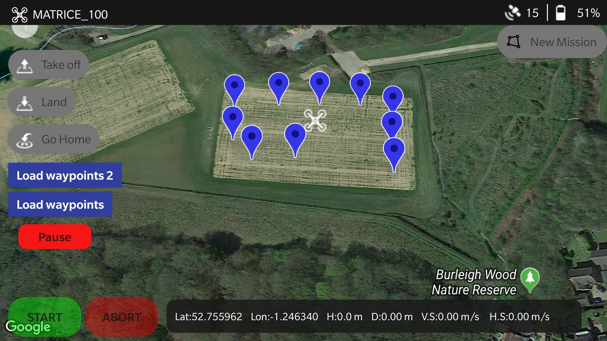
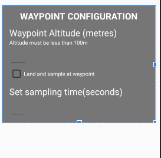

# flightcontrol
Android App to control DJI ROS OnboardSDK UAVs and Flight controllers 

flightcontrol is an Android App used to set control and set waypoints for DJI OnboardSDK ROS devices using the DJI Mobile SDK and Google Maps. App has been tested and works with the following devices:
   * DJI Matrice 100
   * DJI N3 Flight Controller
   * DJI A3 Flight Controller

## Usage
 This app requires the ROS package [dji_flight_planner](https://github.com/InterestingWalrus/dji_flight_planner) in order to send commands to the drone. 

* See the initial setup for the ROS package on the readme page
* Start the ROS package on the drone.
* Long press on the mobile device's screen to add waypoint. Select waypoint altitude and if drone should land at the waypoint. 

* Click on new mission to add  UAV speed and end of mission action.
* Press Start.  

 
